# Pathfinding Algorithm Performance Report

This report presents an integrated analysis of five pathfinding algorithms implemented in **.NET 10**.
Two of these algorithms (Greedy and A*) use Manhattan and Euclidean heuristics, resulting in a total of **seven major scenarios**.  
Each algorithm was tested against adjacency matrices of sizes: $3\times3$, $4\times4$, $16\times16$, $32\times32$, and $64\times64$.

- Breadth-First Search (BFS)
- Depth-First Search (DFS)
- Dijkstra
- Greedy Best-First Search (GBFS)
  - Manhattan heuristic
  - Euclidean heuristic
- A*
  - Manhattan heuristic
  - Euclidean heuristic

Two complementary data sources were used during the analysis:

1. Micro-benchmarks using [BenchmarkDotNet](https://github.com/dotnet/BenchmarkDotNet), executed on **Linux**, **macOS**, and **Windows**, across both **x64** and **ARM** architectures.
2. Execution reports generated by the main application, containing:
   - **COST**: total cost of the computed path.
   - **EXPANDED NODES**: number of visited nodes.
   - **PATH**: the sequence of nodes in the resulting route.
   - **TIME**: execution duration for a single run.

Together, these datasets provide a thorough understanding of several dimensions of algorithmic behavior:

- Performance  
- Optimality  
- Heuristic influence  
- Scaling with graph size  
- Search-space exploration  
- Cross-platform consistency  

---

## Methodology

### Graph Representation

The input is an **adjacency matrix**, where each row and column corresponds to a node in the graph.  
The value at position $(i, j)$ corresponds to the cost of the edge connecting node $i$ to node $j$:

- If the value is $\gt 0$, there exists a valid edge with that weight.
- If the value is $\leq 0$, no direct connection exists between the nodes.

This representation does **not** describe a grid with obstacles; instead, it defines a weighted graph whose connectivity is entirely determined by the adjacency matrix.

### Algorithms Tests

All algorithms were implemented using the same graph structure and evaluated with:

- Four-directional adjacency, consistent with edges defined in the matrix.
- The same start and target nodes across all tests.
- Identical matrix sizes ($3\times3$ to $64\times64$).
- The same cost model and input format.

BenchmarkDotNet tests were executed using [GitHub Actions](https://github.com/features/actions) on six platform configurations:

| OS      | Architecture | Version              | CPU                                                                    |
|---------|:------------:|----------------------|------------------------------------------------------------------------|
| Linux   | ARM          | Ubuntu 24.04.3 LTS   | Neoverse-N2, 4 physical cores                                          | 
| Linux   | x64          | Ubuntu 24.04.3 LTS   | AMD EPYC 7763 2.45GHz, 1 CPU, 4 logical and 2 physical cores           |
| macOS   | ARM          | macOS Sequoia 15.7.1 | Apple M1 (Virtual), 1 CPU, 3 logical and 3 physical cores              |
| macOS   | x64          | macOS Sequoia 15.7.1 | Intel Core i7-8700B CPU 3.20GHz, 1 CPU, 4 logical and 4 physical cores |
| Windows | ARM          | Windows 11           | Cobalt 100 3.40GHz, 1 CPU, 4 logical and 4 physical cores              |
| Windows | x64          | Windows 11           | AMD EPYC 7763 2.44GHz, 1 CPU, 4 logical and 2 physical cores           |

The structure of the execution report generated per algorithm is:

```txt
ALGORITHM: <algorithm name>
HEURISTIC: <Manhattan / Euclidean / empty>
SOURCE / TARGET
PATH: <sequence of node indices>
COST: <sum of weights>
EXPANDED NODES: <count>
TIME (ms): <single execution time>
```

---

## Integrated Results Overview

Both benchmarks and execution reports reveal a consistent hierarchy of performance and quality:

### Greedy Best-First Search
Fastest algorithm, visiting extremely few nodes, but the resulting path is frequently not optimal due to complete reliance on the heuristic.

### A* 

- Always produces optimal paths.
- Significantly faster than Dijkstra thanks to heuristic guidance, offering the best balance between speed and optimality.

### Dijkstra
Guarantees optimality, but explores more nodes than A*, making it slower in practice.

### BFS
Ignores weights, producing suboptimal results on weighted graphs, and explores large portions of the search space.

### DFS
Produces the worst path quality, explores deeply and inefficiently, and has the poorest performance on larger matrices.

These conclusions remained stable across all operating systems and hardware architectures tested.

---

## Heuristic Analysis (Manhattan vs Euclidean)

The evaluation function used to determine which node should be explored next is given by:

$$
f(n) = g(n) + h(n)
$$

Where:
- $n \in V$ is a vertex in the graph.
- $g(n)$ is the accumulated cost from the start node to $n$:

$$
g(n) = \sum_{(u,v) \in P_{start \rightarrow n}} w(u, v)
$$

- $P_{start \rightarrow n}$ is the ordered sequence of edges along the discovered path.
- $(u, v) \in E$ is an edge connecting nodes $u$ and $v$.
- $w(u, v)$ is the weight associated with the edge $(u, v)$, representing the cost of traversal.
- $h(n)$ is the heuristic estimate of the remaining distance between node $n$ and the goal:

$$
h : V \rightarrow \mathbb{R}_{\ge 0}
$$

The value $f(n)$ determines the priority of node $n$ in the open list, directly influencing the search’s direction.

### Greedy Best-First Search

The **GBFS** algorithm uses only the heuristic component:

$$
f(n) = h(n)
$$

Because it ignores the accumulated cost $g(n)$, GBFS behaves similarly to a "beacon-following" search: 
It simply moves in the direction that appears closest to the goal according to the heuristic. 

This leads to:

- Minimal search-space exploration.
- High-speed performance.
- Highly variable path quality.
- Strong dependence on the chosen heuristic.

The inconsistency between heuristics becomes clear in the path cost table:

|     Size     | Manhattan | Euclidean  |
|:------------:|:---------:|:----------:|
|  $3\times3$  |    12     |     13     |
|  $4\times4$  |    31     |     35     |
| $16\times16$ |    148    |    157     |
| $32\times32$ |    334    |    228     |
| $64\times64$ |    589    |    673     |

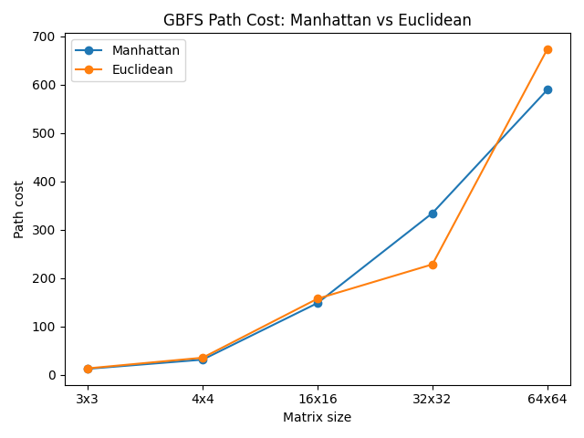

#### Nodes Expanded (GBFS)

Despite the differences in path cost between Manhattan and Euclidean, both heuristics expanded **the same number of nodes** in all scenarios. 
This happens because GBFS selects nodes solely based on the heuristic value $h(n)$, without considering the accumulated cost $g(n)$. 

Although Manhattan and Euclidean may assign different heuristic values to each node, their relative ordering in these grid-like graphs often leads GBFS to follow the same sequence of explored nodes.
As a result, the **search space explored by GBFS remains identical** for both heuristics, even though the **final paths may differ significantly in total cost**. 

This reinforces one of the key characteristics of GBFS: The heuristic strongly influences the chosen route but does not necessarily increase or decrease the number of visited nodes. 
Instead, it primarily alters the *direction* of the search, not its *breadth*.


|     Size     | Expanded Nodes |
|:------------:|:---------------:|
| $16\times16$ |       31        |
| $32\times32$ |       63        |
| $64\times64$ |      127        |

### A* Search

The **A*** algorithm uses the complete evaluation function:

$$
f(n) = g(n) + h(n)
$$

Because it retains both accumulated cost and heuristic estimates, A* can reduce the number of expanded nodes while still guaranteeing optimality on weighted graphs. 

In this project:

- Both Manhattan and Euclidean heuristics produced identical path costs across all matrix sizes.
- Differences were observed only in computational overhead, with Manhattan being slightly faster.

Optimal results:

|     Size     | Manhattan | Euclidean |
|:------------:|:---------:|:---------:|
|  $3\times3$  |     7     |     7     |
|  $4\times4$  |    19     |    19     |
| $16\times16$ |    91     |    91     |
| $32\times32$ |    188    |    188    |
| $64\times64$ |    348    |    348    |

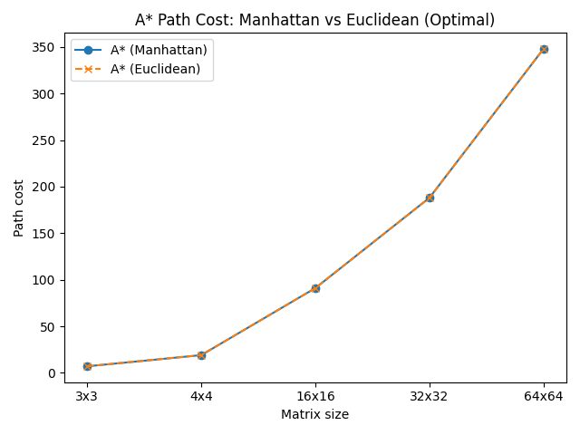

#### Nodes Expanded (A*)

In the case of A*, both heuristics produced identical path costs and expanded the same number of nodes across all graph sizes. 
This behavior emerges because Manhattan and Euclidean are both **admissible** and **consistent** heuristics in grid-like graphs, meaning they never overestimate the actual distance to the goal and preserve the monotonicity condition required for optimal A* search.

Since both heuristics generate priority values $f(n) = g(n) + h(n)$ that differ only by a constant scaling factor, their ordering of nodes in the open set remains effectively the same. 

As a consequence, A* explores the same search space regardless of whether Manhattan or Euclidean distance is used. The two heuristics influence computation time only through their arithmetic complexity, not through the search's structure.

In practice, Manhattan offers a slight performance advantage due to lower computational cost, whereas Euclidean does not yield any reduction in explored nodes. 

For that reason, it confirms that, for A*, **the choice between Manhattan and Euclidean affects execution time but not correctness, optimality, or the breadth of the search**.

|     Size     | Expanded Nodes  |
|:------------:|:---------------:|
| $16\times16$ |      256        |
| $32\times32$ |     1024        |
| $64\times64$ |     4096        |

---

## Algorithm-by-Algorithm Analysis

This section presents a detailed comparison of each algorithm, combining execution reports (`COST` and `EXPANDED NODES`) with microbenchmark results from BenchmarkDotNet. 
The goal is to analyze how each algorithm behaves in practice, how it interacts with graph structure, and how its design decisions influence performance and optimality.

### Breadth-First Search (BFS)

BFS treats all edges as having the exact cost, which makes it optimal only on unweighted graphs. 
Since the adjacency matrices used in this project contain arbitrary edge weights, BFS inevitably produces suboptimal paths. 
Its tendency to explore neighbors uniformly leads to larger search spaces, especially on bigger matrices.

|     Size     | Path Cost | Expanded Nodes |
|:------------:|:---------:|:--------------:|
|  $3\times3$  |    12     |     Small      |
|  $4\times4$  |    31     |     Medium     |
| $16\times16$ |    148    |      256       |
| $32\times32$ |    334    |      1024      |
| $64\times64$ |    589    |      4096      |

BFS is straightforward but inefficient for weighted graphs. It systematically expands large portions of the graph, resulting in higher execution times and significant memory usage.

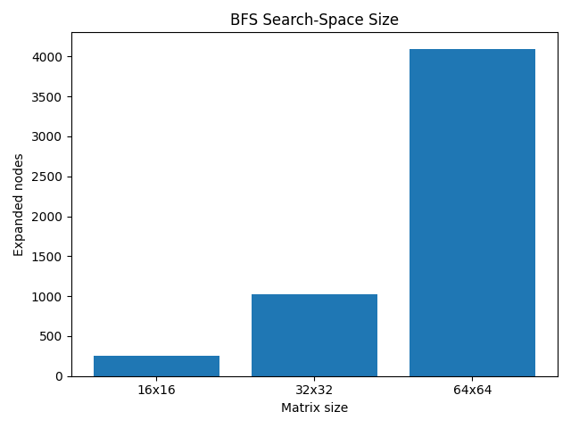

----

### Depth-First Search (DFS)

DFS follows a single path as profoundly as possible before backtracking. While this strategy can be simple to implement, it is highly unsuitable for pathfinding:
- It produces the worst path costs among all algorithms.
- It expands deep regions of the graph with little regard to direction.
- Its behavior is extremely sensitive to graph layout.

|     Size     | Path Cost | Expanded Nodes |
|:------------:|:---------:|:--------------:|
|  $3\times3$  | Very high |  Small/Medium  |
|  $4\times4$  | Very high |     Medium     |
| $16\times16$ |   1207    |      241       |
| $32\times32$ |   5007    |      993       |
| $64\times64$ |   20316   |      4033      |

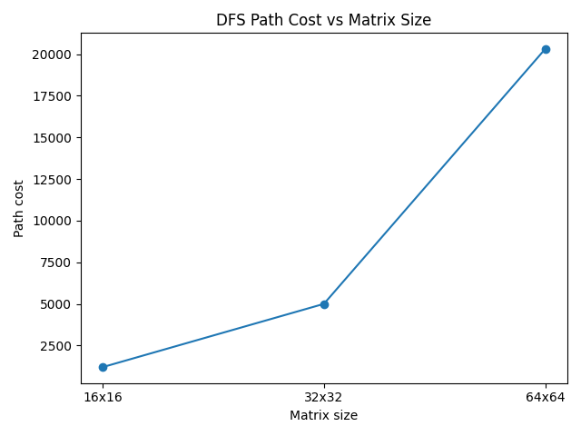

----

### Dijkstra

Dijkstra is a classical shortest-path algorithm. It guarantees optimality but does not use heuristics, which causes it to explore more nodes than necessary.

|     Size     | Path Cost | Expanded Nodes |
|:------------:|:---------:|:--------------:|
|  $3\times3$  |     7     |     Small      |
|  $4\times4$  |    19     |     Medium     |
| $16\times16$ |    91     |      311       |
| $32\times32$ |    188    |      1255      |
| $64\times64$ |    348    |      5086      |

Even though Dijkstra is optimal, it is consistently slower than A*, especially as the matrix size increases. 
Its lack of heuristic guidance causes extensive expansion of the search space.

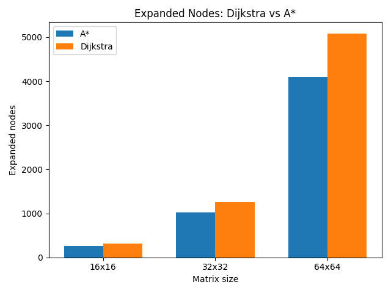

----

### Greedy Best-First Search (GBFS)

GBFS prioritizes the node with the smallest heuristic value. This produces extreme speed, but not necessarily optimal paths. 
As previously shown, the number of expanded nodes remains the same for both the Manhattan and Euclidean heuristics.

|     Size     | Path Cost (Manhattan) | Path Cost (Euclidean) | Expanded Nodes |
|:------------:|:---------------------:|:---------------------:|:--------------:|
|  $3\times3$  |          12           |          13           |     Small      |
|  $4\times4$  |          31           |          35           |  Small/Medium  |
| $16\times16$ |          148          |          157          |       31       |
| $32\times32$ |          334          |          228          |       63       |
| $64\times64$ |          589          |          673          |      127       |

GBFS is excellent for fast approximations but cannot be trusted for optimal solutions. Its performance increases dramatically with graph size, but accuracy decreases.

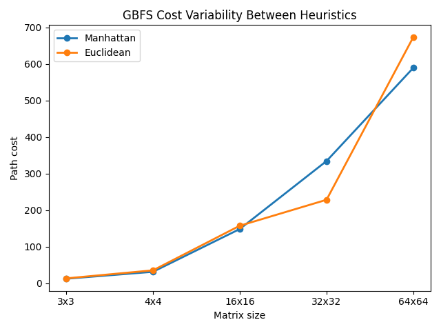

----

### A* Search

A* combines the accumulated path cost $g(n)$ with the heuristic $h(n)$ to balance directionality and optimal exploration. In this project:

- Both heuristics produced identical optimal paths.
- Expanded nodes remained the same for both heuristics.
- Manhattan was slightly faster due to a simpler distance calculation.

|     Size     | Path Cost (Manhattan/Euclidean) | Expanded Nodes |
|:------------:|:-------------------------------:|:--------------:|
|  $3\times3$  |                7                |     Small      |
|  $4\times4$  |               19                |     Medium     |
| $16\times16$ |               91                |      256       |
| $32\times32$ |               188               |      1024      |
| $64\times64$ |               348               |      4096      |

A* offers the best balance between performance and accuracy among all algorithms evaluated.

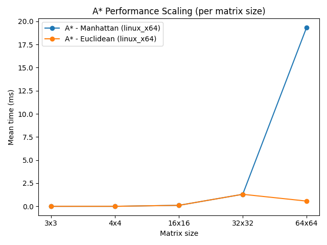

---

## Scaling Behavior

Scaling behavior reflects how execution time, search-space size, and algorithmic complexity evolve as the matrix grows.

### Execution Time Scaling

BenchmarkDotNet results reveal the following general trend:

- GBFS is consistently the fastest, with execution time growing nearly logarithmically.
- A* increases linearly with graph size, reflecting its balanced use of cost and heuristic.
- BFS and DFS experience substantial growth due to the large search spaces they traverse.
- Dijkstra grows faster than A* because of its lack of heuristic pruning.

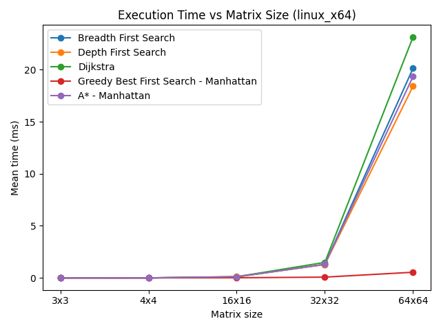

---

### Search-Space Scaling (Expanded Nodes)

The number of nodes explored grows as follows:

|     Size     | GBFS |   A* |  BFS | Dijkstra |  DFS |
|:------------:|-----:|-----:|-----:|---------:|-----:|
| $16\times16$ |   31 |  256 |  256 |      311 |  241 |
| $32\times32$ |   63 | 1024 | 1024 |     1255 |  993 |
| $64\times64$ |  127 | 4096 | 4096 |     5086 | 4033 |

GBFS grows the slowest, while BFS and A* grow identically due to the uniform structure of the matrix graph. Dijkstra and DFS expand even more nodes.

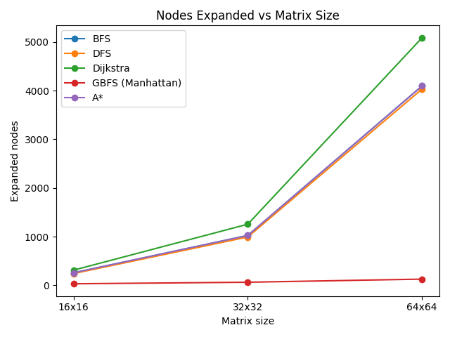

---

### Path Cost Divergence

The path cost becomes a clear indicator of accuracy:

- A* and Dijkstra remain optimal.
- BFS and GBFS deviate significantly as size increases.
- DFS grows explosively and unpredictably.

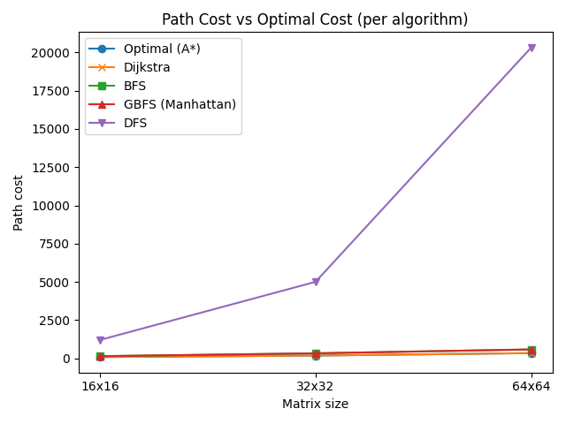

---

## Cross-Platform Analysis

Despite architectural differences between CPU types and operating systems, all relative behaviors remained stable:

- GBFS was the fastest algorithm on all platforms.
- A* consistently beat Dijkstra.
- BFS and DFS consistently performed the worst.
- Manhattan remained slightly faster than Euclidean due to cheaper heuristic calculations.
- No algorithm showed platform-dependent deviations in correctness, expanded nodes, or path cost.

Absolute execution times varied slightly:

- Linux x64 and macOS ARM tended to produce the lowest times.
- Windows ARM displayed the highest variance.
- macOS x64 remained stable but slightly slower than Linux.

These differences, however, did not change the algorithmic conclusions.

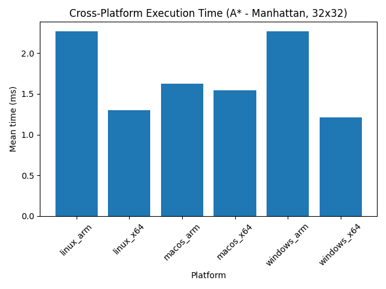

---

## Conclusion

This study provides a complete evaluation of five major pathfinding algorithms (seven total scenarios including heuristics) across multiple adjacency-matrix sizes and execution platforms. 
The combination of micro-benchmark data and detailed execution logs enables us to assess each algorithm from both theoretical and practical perspectives.

The most important conclusions are:

- A* offers the best balance between performance and optimality.
- GBFS achieves unmatched performance but sacrifices reliability in path quality.
- Dijkstra is always optimal but inefficient without heuristic guidance.
- BFS is unsuitable for weighted graphs.
- DFS is the poorest choice for pathfinding and scales poorly.
- Manhattan and Euclidean heuristics behave differently in GBFS but identically in A*.
- Cross-platform behavior is stable and consistent.

Overall, for applications requiring optimal solutions, A* is the recommended algorithm.
For scenarios that prioritize speed over accuracy, GBFS delivers excellent performance.

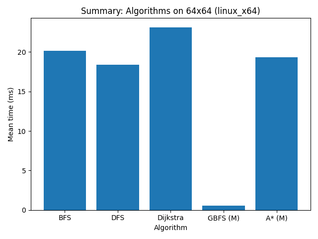